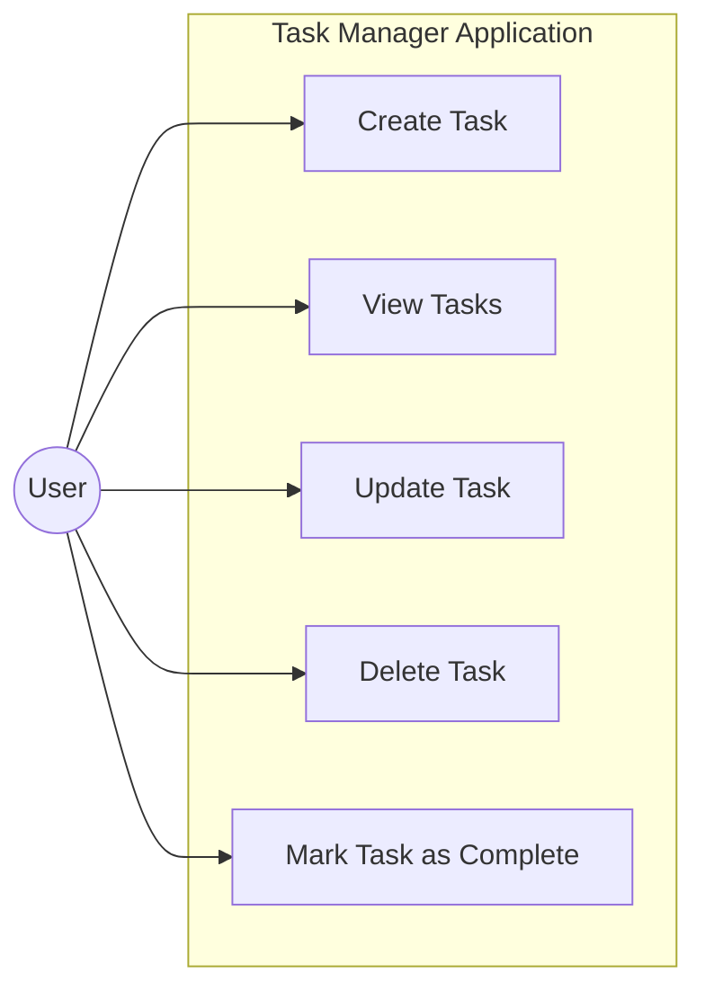

# Use Case Diagram – Task Manager

```mermaid
flowchart LR
    User((User))

    subgraph TaskManager["Task Manager Application"]
        Create["Create Task"]
        Read["View Tasks"]
        Update["Update Task"]
        Delete["Delete Task"]
        Complete["Mark Task as Complete"]
    end

    User --> Create
    User --> Read
    User --> Update
    User --> Delete
    User --> Complete
```
