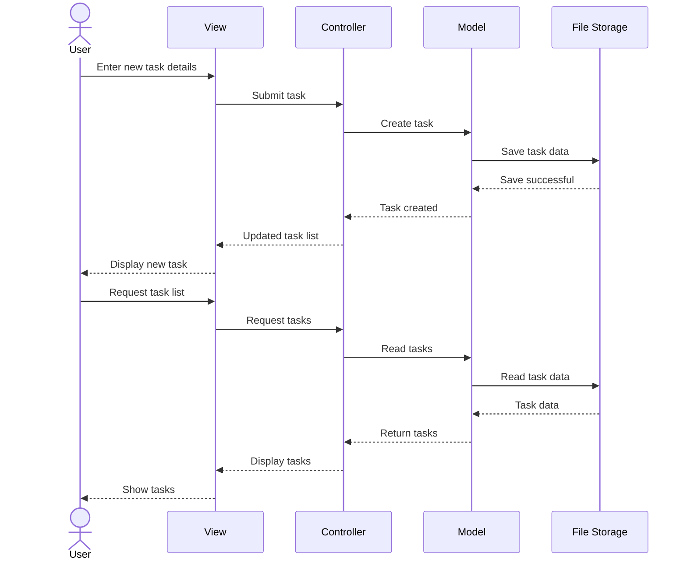

# Sequence Diagram – Task Manager

```mermaid
sequenceDiagram
    actor User
    participant View
    participant Controller
    participant Model
    participant FileStorage as File Storage

    User->>View: Enter new task details
    View->>Controller: Submit task
    Controller->>Model: Create task
    Model->>FileStorage: Save task data
    FileStorage-->>Model: Save successful
    Model-->>Controller: Task created
    Controller-->>View: Updated task list
    View-->>User: Display new task

    User->>View: Request task list
    View->>Controller: Request tasks
    Controller->>Model: Read tasks
    Model->>FileStorage: Read task data
    FileStorage-->>Model: Task data
    Model-->>Controller: Return tasks
    Controller-->>View: Display tasks
    View-->>User: Show tasks
```
