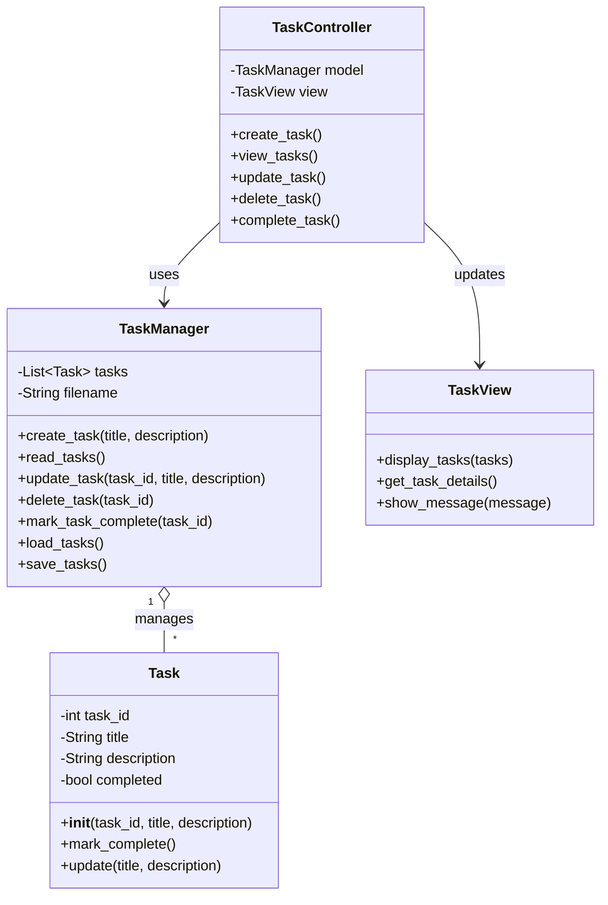

# Class Diagram – Task Manager

```mermaid
classDiagram
    class Task {
        -int task_id
        -String title
        -String description
        -bool completed
        +__init__(task_id, title, description)
        +mark_complete()
        +update(title, description)
    }

    class TaskManager {
        -List~Task~ tasks
        -String filename
        +create_task(title, description)
        +read_tasks()
        +update_task(task_id, title, description)
        +delete_task(task_id)
        +mark_task_complete(task_id)
        +load_tasks()
        +save_tasks()
    }

    class TaskView {
        +display_tasks(tasks)
        +get_task_details()
        +show_message(message)
    }

    class TaskController {
        -TaskManager model
        -TaskView view
        +create_task()
        +view_tasks()
        +update_task()
        +delete_task()
        +complete_task()
    }

    TaskManager "1" o-- "*" Task : manages
    TaskController --> TaskManager : uses
    TaskController --> TaskView : updates
```
