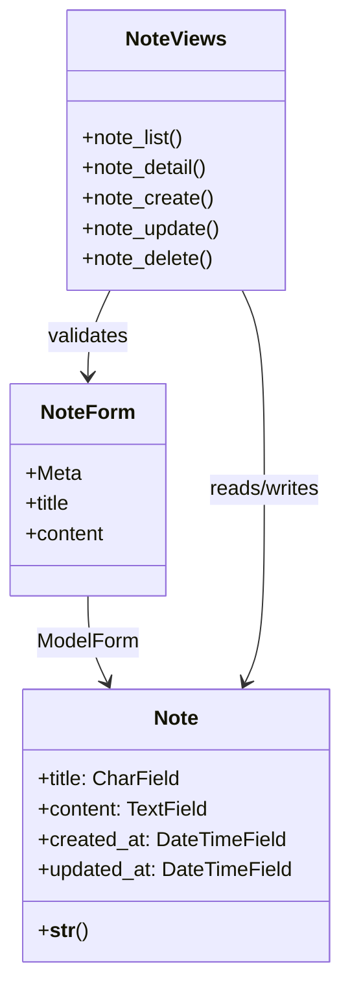

# Class Diagram

```mermaid
classDiagram
class Note {
 +title: CharField
 +content: TextField
 +created_at: DateTimeField
 +updated_at: DateTimeField
 +__str__()
}
class NoteForm {
 +Meta
 +title
 +content
}
class NoteViews {
 +note_list()
 +note_detail()
 +note_create()
 +note_update()
 +note_delete()
}
NoteForm --> Note : ModelForm
NoteViews --> Note : reads/writes
NoteViews --> NoteForm : validates
```
