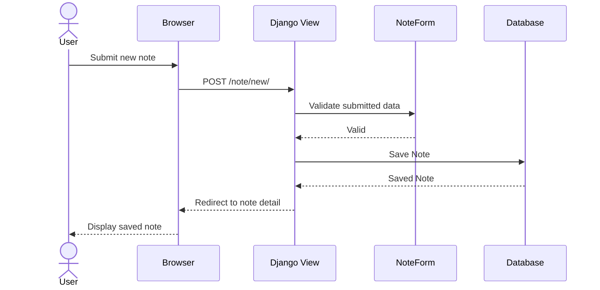

# Sequence Diagram

```mermaid
sequenceDiagram
actor User
participant Browser
participant Django as Django View
participant Form as NoteForm
participant DB as Database
User->>Browser: Submit new note
Browser->>Django: POST /note/new/
Django->>Form: Validate submitted data
Form-->>Django: Valid
Django->>DB: Save Note
DB-->>Django: Saved Note
Django-->>Browser: Redirect to note detail
Browser-->>User: Display saved note
```
